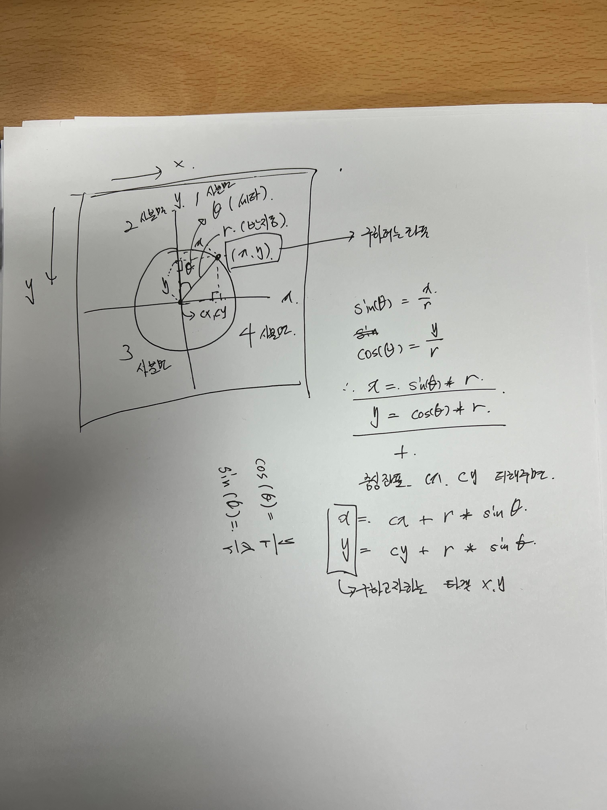
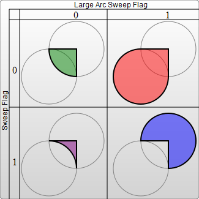

# 📒 React로 핵사곤 차트 컴포넌트 만들기 2

## 요구사항

* 아래와 같이 핵사곤을 파이가 짤린 도형안에 그려야 한다.
* \[그림1] 처럼 파드의 상태에 따라 색상이 달라져야 한다.&#x20;
* \[그림2] 처럼 네임스페이스, 클러스터 등 의미있는 단위로 그룹할 수 있어야 한다.

<figure><figcaption><p>[그림1]</p></figcaption></figure>

<figure><figcaption><p>[그림2]</p></figcaption></figure>


## 그려보자


배이스 라이브러리는 [React로 핵사곤 차트 컴포넌트 만들기 1](https://lak-hyeon.gitbook.io/development-note/just-memo/react-1) 을 참고 하기를 바란다.


### 부채꼴 형태는 어떻게 그릴 수 있을까?


원의 중심 좌표에서 반지름 (radius) 만큼 떨어지고, 0 도 부터 시계 방향으로 떨어진 θ 각을 알 때 좌표 값을 구할 수 있다.

아래 코드를 보자

```javascript
export const polarToCartesian = (
  cx: number, // 중심 좌표 x
  cy: number, // 중심 좌표 y
  radius: number,
  angle: number,
): Point => {
  const radians = (angle - 90) * DEGREE_TO_RADIAN; // (Math.PI / 180.0)
  return {
    x: cx + radius * Math.cos(radians),
    y: cy + radius * Math.sin(radians),
  };
};
```

<figure><figcaption><p>[polarToCartesian]</p></figcaption></figure>

삼각 함수를 이용하면 쉽게 구할 수 있다.&#x20;

중요한건 코드를 보면 -90도를 한 이유는 하지 않게 되면 1, 4 분면에 반원이 그려진다.

각을 90도 돌려 반원에 위치하려고 빼주었다.


이 공식으로 아래 그림과 같이 각 θ를 가진 파이가 잘린 모양의 4 꼭지점의 좌표를 모두 구할 수 있다.

<figure><figcaption></figcaption></figure>

아래 코드를 보자

```tsx
const PieSlice: React.FC<PieSliceProps> = ({
  cx,
  cy,
  radius,
  startAngle,
  endAngle,
  thickness,
  style,
}) => {
  const startOuter = polarToCartesian(cx, cy, radius, startAngle);
  const endOuter = polarToCartesian(cx, cy, radius, endAngle);
  const startInner = polarToCartesian(cx, cy, radius - thickness, startAngle);
  const endInner = polarToCartesian(cx, cy, radius - thickness, endAngle);

  const largeArcFlag = endAngle - startAngle <= 180 ? "0" : "1";

  const pathData = `
    M ${startInner.x} ${startInner.y}
    A ${radius - thickness} ${radius - thickness} 0 ${largeArcFlag} 1 ${endInner.x} ${endInner.y}
    L ${endOuter.x} ${endOuter.y}
    A ${radius} ${radius} 0 ${largeArcFlag} 0 ${startOuter.x} ${startOuter.y}
    Z
  `;

  return <path d={pathData} style={style} />;
};

export default PieSlice;
```


파이가 잘린 두깨를 `thickness props`로 제공 하여 원하는 크기 만큼 줄 수 있고 반지름과 가까우면 완전한 부채꼴이 될 것이고 차이가 많이 나면 그만큼 얇아 질 것이다.


원의 중심과 가까운 점을 `inner`, 먼점을 `outer`로 지정 하였고 4개의 모든 점을 알면 `svg path` 태그로 인해 곡선과 직선을 가진 도형을 쉽게 그릴 수 있다.


`M (move to): M ${startInner.x} ${startInner.y} 시작 좌표로 이동`

`A (Arc Curve): A ${radius - thickness} ${radius - thickness} 0 ${largeArcFlag} 1 ${endInner.x} ${endInner.y} 안쪽 호를 그림`

`L (Lint to): L ${endOuter.x} ${endOuter.y} 외각 끝점 까지 직선`

`A (Arc Curve): A ${radius} ${radius} 0 ${largeArcFlag} 0 ${startOuter.x} ${startOuter.y} 와각 호를 그림`

`Z: 닫음`


여기서 호를 그릴때 주의 해야 할 사항이 있다.

<figure><figcaption><p>[출처] <a href="https://developer.mozilla.org/ko/docs/Web/SVG/Tutorial/Paths#%EC%9B%90%ED%98%B8"> https://developer.mozilla.org/ko/docs/Web/SVG/Tutorial/Paths#원호</a></p></figcaption></figure>

아래가 위 그림의 설명이다.

**큰 호 플래그 (large-arc-flag)**

0: 그려진 원호의 쌍 중 짧은 호를 사용

1: 그려진 원호의 쌍 중 긴 호를 사용

**쓸기 방향 플래그 (sweep-flag)**

0: 반시계방향으로 호를 그림 즉, 원호의 꼭짓점 방향과 반대쪽으로 호를 그림

1: 시계방향으로 호를 그림 즉, 원호의 꼭짓점 방향으로 호를 그림


위 `path`에서 시작 점을 `startInner` 좌표로 시작 하였으며 안쪽 호의 쓸기 방향은 `1`이 여야 하고 각이 `180` 도 보다 크면 긴 호를 선택 하여야 한다.

반대로 밖같쪽 호의 경우 `endOuter` 좌표로 시작 하였으며 반시계 방향으로 그려짐으로 쓸기 방향은 `0`이여야 하고 각이 180도 보다 크면 긴 호를 선택한다.


### 부채꼴 형태에 핵사곤을 어떻게 배치 할 수 있을까?


먼저 부재꼴의 중심을 구한다.

아래 코드를 보자

```javascript
// 파이 슬라이스 중심 계산 함수 추가
export const getPieSliceCenter = (
  cx: number,
  cy: number,
  radius: number,
  thickness: number,
  startAngle: number,
  endAngle: number,
) => {
  const middleAngle = (startAngle + endAngle) / 2;
  const distanceFromCenter = radius - thickness / 2;
  return polarToCartesian(cx, cy, distanceFromCenter, middleAngle);
};
```


`polarToCartesian` 함수는 위에서 설명 하였고, 부채꼴의 잘린 형태의 중앙각 즉 부재꼴의 중앙 각은 시작 각, 끝 각을 더하여 2로 나누어 주면 중앙의 각을 알 수가 있다.


두깨(`thickness`) 길이를 2로 나눈 값을 외부 반지름(`radius`)에서 빼주면 원의 중심에서 거리를 구할 수 있다

마지막으로 `polarToCartesian` 함수로 정확하게 파이슬라이스 또는 부채꼴의 중심을 알 수 있다.


### 중심으로 부터 그려지도록 해보자


위 단계에서 파이슬라이스 또는 부채꼴 일때 중심을 구하였다. 이 지점을 [react-hexgrid](https://www.npmjs.com/package/react-hexgrid?activeTab=readme) 의 Hex q,r,s 좌표로 변환 하고

핵사곤 6방향으로 퍼져나가면서 그리면된다.


우선 [HexUtils.hexToPixel](https://github.com/Hellenic/react-hexgrid/blob/master/src/HexUtils.ts#L133), [HexUtils.pixelToHex](https://github.com/Hellenic/react-hexgrid/blob/master/src/HexUtils.ts#L149) 이게 필요하다.&#x20;

귀찮은 파라미터가 있으니 걍 다시 정의 했다.


먼저 핵사곤 좌표를 픽셀 좌표로 변환 하려면 [변환공식](https://www.redblobgames.com/grids/hexagons/#hex-to-pixel-axial) 이용한다.

x, y 의 기저 백터를 이용하여 변환 공식을 유도 q,  r 값에 변환 행혈


\


