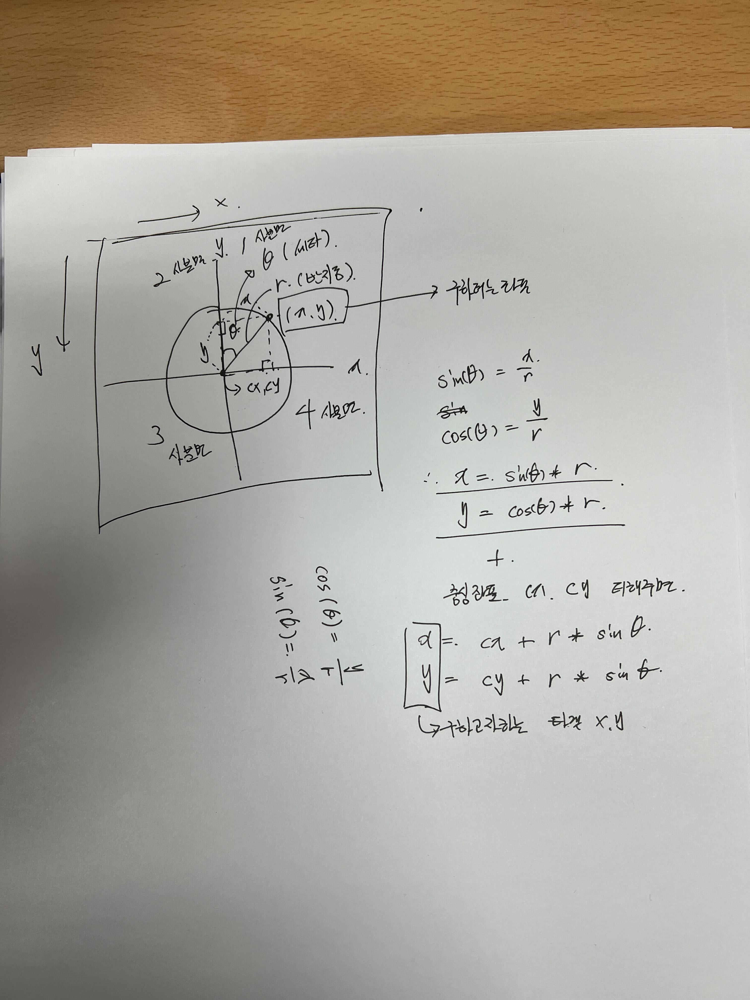
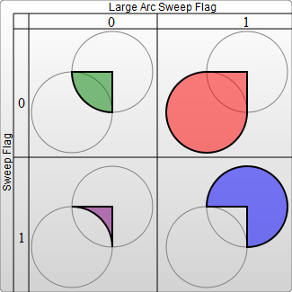

# 📒 React로 헥사곤 차트 컴포넌트 만들기 2

## 요구사항

* 아래와 같이 헥사곤을 파이가 짤린 도형안에 그려야 한다.
* \[그림1] 처럼 파드의 상태에 따라 색상이 달라져야 한다.&#x20;
* \[그림2] 처럼 네임스페이스, 클러스터 등 의미있는 단위로 그룹할 수 있어야 한다.

<figure><figcaption><p>[그림1]</p></figcaption></figure>

<figure><figcaption><p>[그림2]</p></figcaption></figure>


## 그려보자


배이스 라이브러리는 [React로 헥사곤 차트 컴포넌트 만들기 1](https://lak-hyeon.gitbook.io/development-note/just-memo/react-1) 을 참고 하기를 바란다.


### 부채꼴 형태는 어떻게 그릴 수 있을까?


원의 중심 좌표에서 반지름 (radius) 만큼 떨어지고, 0 도 부터 시계 방향으로 떨어진 θ 각을 알 때 좌표 값을 구할 수 있다.

아래 코드를 보자

```javascript
export const polarToCartesian = (
  cx: number, // 중심 좌표 x
  cy: number, // 중심 좌표 y
  radius: number,
  angle: number,
): Point => {
  const radians = (angle - 90) * DEGREE_TO_RADIAN; // (Math.PI / 180.0)
  return {
    x: cx + radius * Math.cos(radians),
    y: cy + radius * Math.sin(radians),
  };
};
```

<figure><figcaption><p>[polarToCartesian]</p></figcaption></figure>

삼각 함수를 이용하면 쉽게 구할 수 있다.&#x20;

중요한건 코드를 보면 -90도를 한 이유는 하지 않게 되면 1, 4 분면에 반원이 그려진다.

각을 90도 돌려 반원에 위치하려고 빼주었다.


이 공식으로 아래 그림과 같이 각 θ를 가진 파이가 잘린 모양의 4 꼭지점의 좌표를 모두 구할 수 있다.

<figure><figcaption></figcaption></figure>

아래 코드를 보자

```tsx
const PieSlice: React.FC<PieSliceProps> = ({
  cx,
  cy,
  radius,
  startAngle,
  endAngle,
  thickness,
  style,
}) => {
  const startOuter = polarToCartesian(cx, cy, radius, startAngle);
  const endOuter = polarToCartesian(cx, cy, radius, endAngle);
  const startInner = polarToCartesian(cx, cy, radius - thickness, startAngle);
  const endInner = polarToCartesian(cx, cy, radius - thickness, endAngle);

  const largeArcFlag = endAngle - startAngle <= 180 ? "0" : "1";

  const pathData = `
    M ${startInner.x} ${startInner.y}
    A ${radius - thickness} ${radius - thickness} 0 ${largeArcFlag} 1 ${endInner.x} ${endInner.y}
    L ${endOuter.x} ${endOuter.y}
    A ${radius} ${radius} 0 ${largeArcFlag} 0 ${startOuter.x} ${startOuter.y}
    Z
  `;

  return <path d={pathData} style={style} />;
};

export default PieSlice;
```


파이가 잘린 두깨를 `thickness props`로 제공 하여 원하는 크기 만큼 줄 수 있고 반지름과 가까우면 완전한 부채꼴이 될 것이고 차이가 많이 나면 그만큼 얇아 질 것이다.


원의 중심과 가까운 점을 `inner`, 먼점을 `outer`로 지정 하였고 4개의 모든 점을 알면 `svg path` 태그로 인해 곡선과 직선을 가진 도형을 쉽게 그릴 수 있다.


`M (move to): M ${startInner.x} ${startInner.y} 시작 좌표로 이동`

`A (Arc Curve): A ${radius - thickness} ${radius - thickness} 0 ${largeArcFlag} 1 ${endInner.x} ${endInner.y} 안쪽 호를 그림`

`L (Lint to): L ${endOuter.x} ${endOuter.y} 외각 끝점 까지 직선`

`A (Arc Curve): A ${radius} ${radius} 0 ${largeArcFlag} 0 ${startOuter.x} ${startOuter.y} 와각 호를 그림`

`Z: 닫음`


여기서 호를 그릴때 주의 해야 할 사항이 있다.

<figure><figcaption><p>[출처] <a href="https://developer.mozilla.org/ko/docs/Web/SVG/Tutorial/Paths#%EC%9B%90%ED%98%B8"> https://developer.mozilla.org/ko/docs/Web/SVG/Tutorial/Paths#원호</a></p></figcaption></figure>

아래가 위 그림의 설명이다.

**큰 호 플래그 (large-arc-flag)**

0: 그려진 원호의 쌍 중 짧은 호를 사용

1: 그려진 원호의 쌍 중 긴 호를 사용

**쓸기 방향 플래그 (sweep-flag)**

0: 반시계방향으로 호를 그림 즉, 원호의 꼭짓점 방향과 반대쪽으로 호를 그림

1: 시계방향으로 호를 그림 즉, 원호의 꼭짓점 방향으로 호를 그림


위 `path`에서 시작 점을 `startInner` 좌표로 시작 하였으며 안쪽 호의 쓸기 방향은 `1`이 여야 하고 각이 `180` 도 보다 크면 긴 호를 선택 하여야 한다.

반대로 바같쪽 호의 경우 `endOuter` 좌표로 시작 하였으며 반시계 방향으로 그려짐으로 쓸기 방향은 `0`이여야 하고 각이 180도 보다 크면 긴 호를 선택한다.


### 부채꼴 형태에 헥사곤을 어떻게 배치 할 수 있을까?


먼저 부재꼴의 중심을 구한다.

아래 코드를 보자

```javascript
// 파이 슬라이스 중심 계산 함수 추가
export const getPieSliceCenter = (
  cx: number,
  cy: number,
  radius: number,
  thickness: number,
  startAngle: number,
  endAngle: number,
) => {
  const middleAngle = (startAngle + endAngle) / 2;
  const distanceFromCenter = radius - thickness / 2;
  return polarToCartesian(cx, cy, distanceFromCenter, middleAngle);
};
```


`polarToCartesian` 함수는 위에서 설명 하였고, 부채꼴의 잘린 형태의 중앙각 즉 부재꼴의 중앙 각은 시작 각, 끝 각을 더하여 2로 나누어 주면 중앙의 각을 알 수가 있다.


두깨(`thickness`) 길이를 2로 나눈 값을 외부 반지름(`radius`)에서 빼주면 원의 중심에서 거리를 구할 수 있다

마지막으로 `polarToCartesian` 함수로 정확하게 파이슬라이스 또는 부채꼴의 중심을 알 수 있다.


### 중심으로 부터 그려지도록 해보자


위 단계에서 파이슬라이스 또는 부채꼴 일때 중심을 구하였다. 이 지점을 [react-hexgrid](https://www.npmjs.com/package/react-hexgrid?activeTab=readme) 의 Hex q,r,s 좌표로 변환 하고

헥사곤 6방향으로 퍼져나가면서 그리면된다.


우선 [HexUtils.hexToPixel](https://github.com/Hellenic/react-hexgrid/blob/master/src/HexUtils.ts#L133), [HexUtils.pixelToHex](https://github.com/Hellenic/react-hexgrid/blob/master/src/HexUtils.ts#L149) 이게 필요하다.&#x20;

귀찮은 파라미터가 있으니 걍 다시 정의 했다.


먼저 헥사곤 좌표를 픽셀 좌표로 변환 하려면 [변환공식](https://www.redblobgames.com/grids/hexagons/#hex-to-pixel-axial) 이용한다.

<figure><figcaption><p>[출처] <a href="https://www.redblobgames.com/grids/hexagons/#hex-to-pixel-axial">https://www.redblobgames.com/grids/hexagons/#hex-to-pixel-axial</a></p></figcaption></figure>

위 변환 공식을 사용하게 된다.


`q` 는 가로로 확장되고 `r`은 세로로 확장된다. 따라서&#x20;

`q` 축은 `(x = ROOT3, y = 0) , r 축은 (x = ROOT3/2, y = 3/2)` 만큼 각각 이동되며 여기에 헥사곤 `size + spacing` 까지 고려하여 변환됨

<figure><figcaption><p>[출처] <a href="https://www.redblobgames.com/grids/hexagons/#hex-to-pixel-axial">https://www.redblobgames.com/grids/hexagons/#hex-to-pixel-axial</a></p></figcaption></figure>

위 그림을 보면 `q 축의 확장(→)` 은 헥사곤 너비 만큼이고, `r 축의 확장(↘︎)`은 헥사곤 너비의 반, `size의 1.5배 만큼 즉 3/2` 만큼 커지는 것을 볼 수 있다. (특이하게 r 축 변화는 대각선으로 이루어진다)


> `ROOT3`이 등장하는 이유는 헥사곤 외접 원의 중심에서 각 꼭지점길이가 `size이면` 정삼각형 한변의 길이가 `size` 라고 볼수 있다.  정삼각형 꼭지점에서 밑변으로 수직으로 내린 정삼각형의 높이는 `size * cos(30) = size * (ROOT3 / 2)` 이며 따라서 헥사곤 가로 너비는 `size * ROOT 3` 이된다.&#x20;


<figure><figcaption><p>[출처] <a href="https://www.redblobgames.com/grids/hexagons/#hex-to-pixel-axial">https://www.redblobgames.com/grids/hexagons/#hex-to-pixel-axial</a></p></figcaption></figure>


반대로 픽셀 좌표에서 헥사곤 좌표로 변환하는 방법은 위 변환 공식의 역을 구하면 된다.


<figure><figcaption><p>[출처] <a href="https://www.redblobgames.com/grids/hexagons/#hex-to-pixel-axial">https://www.redblobgames.com/grids/hexagons/#hex-to-pixel-axial</a></p></figcaption></figure>


`s` 값은 `q + r + s = 0` 인 특징을 이용하여 구해 주면된다.


위 공식으로 만들어진 코드는 아래와 같다

```javascript
// 헥사곤을 픽셀 좌표로 변환하는 함수 (pointed top)
export const hexToPixel = (
  hex: Hex,
  hexSize: number,
  spacing: number,
): Point => {
  const x = hexSize * (ROOT3 * hex.q + (ROOT3 / 2) * hex.r);
  const y = hexSize * ((3 / 2) * hex.r);
  return { x: x * spacing, y: y * spacing };
};

// 픽셀을 헥사곤으로 변환하는 함수 (pointed top)
export const pixelToHex = (
  x: number,
  y: number,
  hexSize: number,
  spacing: number,
): Hex => {
  const _x = x / spacing;
  const _y = y / spacing;
  const q = ((ROOT3 / 3) * _x - (1 / 3) * _y) / hexSize;
  const r = ((2 / 3) * _y) / hexSize;
  return new Hex(q, r, -q - r);
};
```


이제 파이슬라이스의 중심을 구했으니 pixel 좌표를 헥사곤 좌표로 변환 해주고 중심부터 퍼져나가게 그릴 수 있도록 [BFS 알고리즘](https://ko.wikipedia.org/wiki/%EB%84%88%EB%B9%84\_%EC%9A%B0%EC%84%A0\_%ED%83%90%EC%83%89)으로 그려주면된다.&#x20;


아래 코드를 보자

```javascript
(centerHex: Hex, maxCount: number): Hex[] => {
      const hexagons = [];
      const queue = [centerHex];
      const visited = new Set();

      while (queue.length > 0 && hexagons.length < maxCount) {
        const hex = queue.shift();
        if (!hex) continue;
        const hexKey = `${Math.round(hex.q)},${Math.round(hex.r)},${Math.round(hex.s)}`;
        if (!visited.has(hexKey)) {
          visited.add(hexKey);
          if (
            isHexagonInsidePieSlice(
              hex,
              cx,
              cy,
              startAngle,
              endAngle,
              radius - thickness,
              radius,
              hexSize,
              spacing,
              sideAngleGap,
              radiusGap,
            )
          ) {
            hexagons.push(hex);
            const neighbors = getHexNeighbors(hex);
            for (const neighbor of neighbors) {
              if (
                !visited.has(
                  `${Math.round(neighbor.q)},${Math.round(neighbor.r)},${Math.round(neighbor.s)}`,
                )
              ) {
                queue.push(neighbor);
              }
            }
          }
        }
      }
      return hexagons;
    }
```


코드를 설명 하면 처음 파이 중앙 위치부터 헥사곤 6면의 이웃 방향으로 너비 우선으로 퍼져 나가면서 `isHexagonInsidePieSlice` 함수로 파이 안쪽으로 그려질 수 있게 판단한다.


`getNexNeighbors` 함수를 살펴보자

```javascript
export const getHexNeighbors = (hex: Hex): HexCoordinates[] => {
  const directions: HexCoordinates[] = [
    { q: 1, r: -1, s: 0 }, // 북동쪽 (Northeast)
    { q: 1, r: 0, s: -1 }, // 동쪽 (East)
    { q: 0, r: 1, s: -1 }, // 남동쪽 (Southeast)
    { q: -1, r: 1, s: 0 }, // 남서쪽 (Southwest)
    { q: -1, r: 0, s: 1 }, // 서쪽 (West)
    { q: 0, r: -1, s: 1 }, // 북서쪽 (Northwest)
  ];

  return directions.map((direction) => ({
    q: hex.q + direction.q,
    r: hex.r + direction.r,
    s: hex.s + direction.s,
  }));
};
```

이렇게 6방향이고 현재 좌표에서 6방향 인접 좌표를 구해준다.


`isHexagonInsidePieSlice` 함수를 보면 `calculateHexCorners` 함수로 6개의 꼭지점을 모두 구한다.&#x20;

단순 중심점만 비교하게되면 결국 파이의 호 밖으로 나가게 그려지기 때문이다.&#x20;


```javascript
// 헥사곤이 파이 슬라이스 내부에 있는지 확인하는 함수
export const isHexagonInsidePieSlice = (
  hex: Hex,
  cx: number,
  cy: number,
  startAngle: number,
  endAngle: number,
  innerRadius: number,
  outerRadius: number,
  hexSize: number,
  spacing: number,
  sideAngleGap: number,
  radiusGap: number,
): boolean => {
  const corners = calculateHexCorners(hex, hexSize, spacing);
  return corners.every((corner) =>
    isPointInsidePieSlice(
      corner.x + cx,
      corner.y + cy,
      cx,
      cy,
      startAngle + sideAngleGap,
      endAngle - sideAngleGap,
      innerRadius + radiusGap,
      outerRadius - radiusGap,
    ),
  );
};

// 헥사곤의 꼭지점을 계산하는 함수 (pointed top)
export const calculateHexCorners = (
  hex: Hex,
  hexSize: number,
  spacing: number,
): Point[] => {
  const center = hexToPixel(hex, hexSize, spacing);
  const corners = [];
  for (let i = 0; i < 6; i++) {
    const angle = DEGREE_TO_RADIAN * (60 * i - 30); // 각 꼭지점의 각도를 계산 (pointed top 고려)
    const x = center.x + hexSize * Math.cos(angle);
    const y = center.y + hexSize * Math.sin(angle);
    corners.push({ x, y });
  }
  return corners;
};

// 점이 파이 슬라이스 내부에 있는지 확인하는 함수
export const isPointInsidePieSlice = (
  x: number,
  y: number,
  cx: number,
  cy: number,
  startAngle: number,
  endAngle: number,
  innerRadius: number,
  outerRadius: number,
): boolean => {
  const angle = Math.atan2(y - cy, x - cx) * RADIAN_TO_DEGREE + 90;
  const distance = Math.sqrt((x - cx) ** 2 + (y - cy) ** 2);

  return (
    angle >= startAngle &&
    angle <= endAngle &&
    distance >= innerRadius &&
    distance <= outerRadius
  );
};
```


`calculateHexCorners` 함수로 파이 헥사곤 중심 부터 `60` 도 간격으로 6개의 점을 구하면된다. 이때 주의 할 점은 `pointed-top` (꼭지점이 상단으로 간 모양) 일때 `-30` 를 빼주어 돌아간 정보를 포함을 해주어야 한다.

`isPointInsidePieSlice` 함수는 각 꼭지점이 파이슬라이스의 `start angle` 값과 `end` 값, 바깥쪽 큰 호, 안쪽 작은 호 내부에 `pixel` 점이 포함되어 있는지 판단한다.&#x20;

이때 `중점 (cx, cy)와 세타(θ) 값, 반지름(r)`을 알면 점을 알 수 있듯 반대로 `중점 (cx, cy), 점 (x, y)` 를 알면 탄젠트의 역함수로 변화량을 넣어주면 `세타(θ)` 를 구할 수 있다.

`+90`도를 한 이유는 위 `polarToCartesian` 함수에서 `-90`돌린 상태 이기 때문이다.


이렇게 하면 파이슬라이스 안에 헥사곤을 수량에 맞게 그릴 수 있다.


위 BFS 알고리즘에서 주의 사항이 하나 있는데 헥사곤 좌표를 방문 표시를 할때 반올림 (Math.round) 처리를 해주지 않으면 부동소수점 오차로 같은 값이지만 실수로는 다르게 표현 됨으로 정확하게 방문 표시가 안될 수 있다.&#x20;

따라서, 이를 반올림 처리로 해결한다.


## 헥사곤 컴포넌트 전체 소스코드 및 스토리북







## 적용화면

노드별 그룹된 파드 현황 컴포넌트

<figure><figcaption></figcaption></figure>

