# 📒 Yorkie로 동시 편집 환경에서 undo/redo 만들기

## Design multiplayer undo / redo <a href="#design-multiplayer-undo--redo" id="design-multiplayer-undo--redo"></a>

### undo / redo 소개 <a href="#undo-redo" id="undo-redo"></a>

* **undo**: 사용자 작업을 이전 상태로 되돌리는 작업
* **redo**: 이미 되돌린 작업을 다시 수행하는 작업

<figure>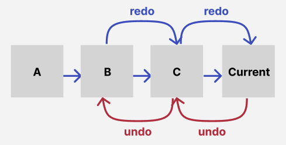<figcaption></figcaption></figure>

### undo / redo 구현 방법 <a href="#undo-redo" id="undo-redo"></a>

1. State 저장
   * 전체 state를 저장하여 해당 상태로 돌리는 방법

<figure><figcaption></figcaption></figure>

2. Delta-State 저장

* State의 특정 시점의 변경 사항만 저장

<figure>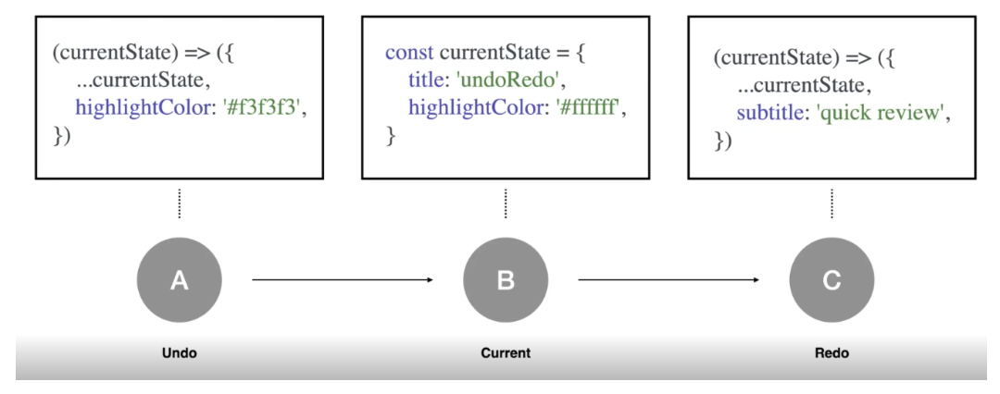<figcaption></figcaption></figure>

3. Action 저장

* State를 변경하는 행위를 저장
* undo 작업 시 역연산 적용 필요

<figure>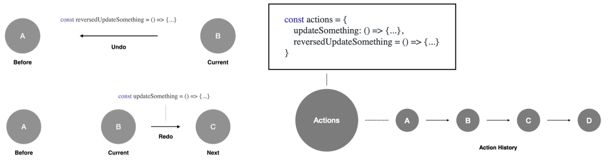<figcaption></figcaption></figure>

### undo / redo 자료구조 <a href="#undo-redo" id="undo-redo"></a>


<figure>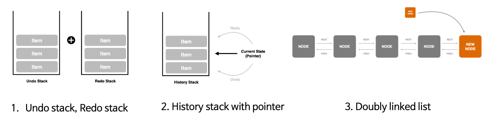<figcaption></figcaption></figure>

### undo / redo 동시성 문제 <a href="#undo-redo" id="undo-redo"></a>

* 동시 작업이 아닌 한 명의 사용자가 undo/redo 작업은 자연스러움
* 하지만, 여러 사용자가 문서의 상태를 변경할 수 있고 실행 취소하면 다른 사용자가 수행한 작업이 삭제될 수 있음

**case1**

* **not good**

<figure>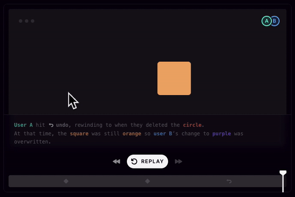<figcaption></figcaption></figure>

> 1. A 사용자가 원을 삭제
> 2. B 사용자가 사각형을 보라색으로 변경
> 3. A 사용자가 뒤로가기(undo)를 하면 A의 이전 상태를 잃어버림

* **good**

<figure>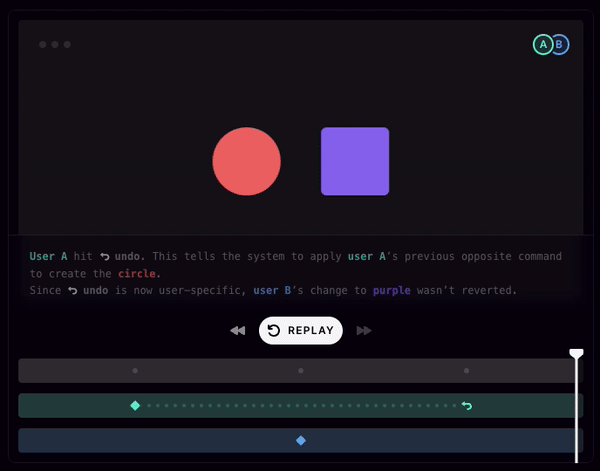<figcaption></figcaption></figure>

> 1. A 사용자가 원을 삭제
> 2. B 사용자가 사각형을 보라색으로 변경
> 3. A 사용자가 뒤로가기(undo)를 하면 A의 원을 삭제 하기 이전, B 사용자가 보라색으로 바꾼 상태도 유지 되어야함

**case2**

<figure>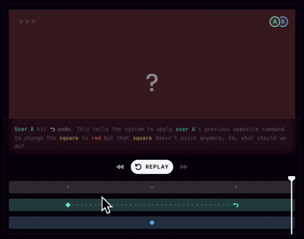<figcaption></figcaption></figure>

> 1. A 사용자가 사각형을 노란색으로 변경
> 2. B 사용자가 사각형을 삭제
> 3. A 사용자가 뒤로가기(undo)를 수행 후 결과???

* **구글 슬라이드, 피그마 예시**

<figure>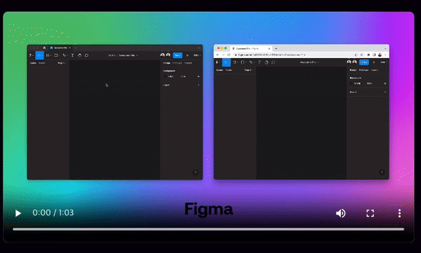<figcaption></figcaption></figure>

> 1. A 사용자가 사각형을 노란색으로 변경
> 2. B 사용자가 사각형을 삭제
> 3. A 사용자가 뒤로가기(undo)를 수행 하여도 사각형은 삭제 된 상태를 유지 (B 행위를 존중)

**ref.** [**https://liveblocks.io/blog/how-to-build-undo-redo-in-a-multiplayer-environment**](https://liveblocks.io/blog/how-to-build-undo-redo-in-a-multiplayer-environment)

### undo / redo 정리 <a href="#undo-redo" id="undo-redo"></a>

<figure>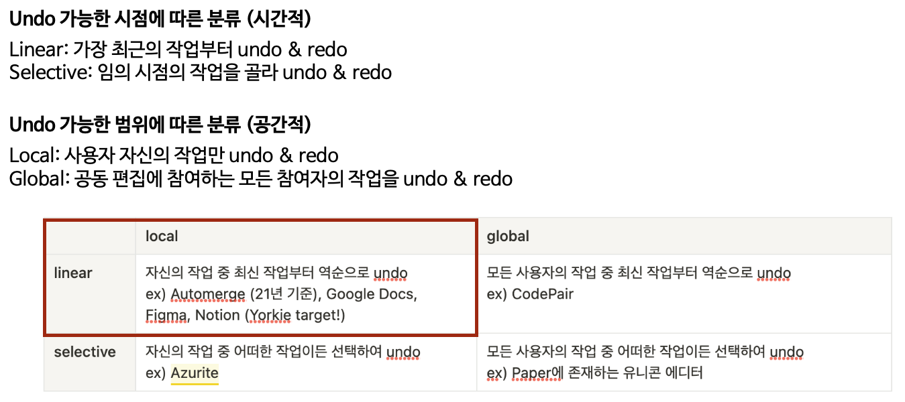<figcaption></figcaption></figure>

* 개별 클라이언트 별 history stack을 가지고 있어야 하며, 다른 유저의 행위도 존중 되어야함

### builder-r3 시행착오 <a href="#builder-r3" id="builder-r3"></a>

#### **1. project 전역 상태를 변경이 될 때 마다 history 전역 상태로 저장**&#x20;


<figure>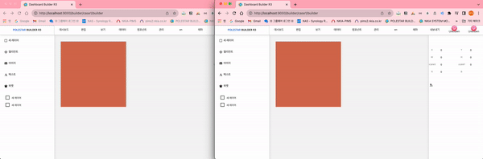<figcaption></figcaption></figure>


> 1. 왼쪽 사용자가 주황색 사각형을 옆으로 2칸 움직임
> 2. 오른쪽 사용자가 주황색 사각형을 아래로 2칸 움직인 후 보라색 사각형을 생성하고 위치를 바꿈
> 3. 왼쪽 사용자가 뒤로가기(undo)를 시행 하였을 때 주황색 사각형은 원래 되돌아 가야할 위치에 이동하나, 오른쪽 사용자가 생성한 보라색 사각형이 사라짐

```javascript
// src/pages/builder.js
// 히스토리 기능
useEffect(() => {
  if (history.present !== project) {
    setHistory((currentHistory) => ({
      past: [...currentHistory.past, currentHistory.present],
      present: project,
      future: [],
    }));
  }
  // eslint-disable-next-line react-hooks/exhaustive-deps
}, [project, history.present]);

// src/yorkie/update/pushLocalChangesIntoRemote.js
// 변경 사항 업데이트
doc.update((root) => {
  root.title = project.title;
  root.description = project.description;
  const differences = deep.diff(root.nodeTree.toJS(), convertedObj);
  if (differences) {
    console.log(differences);
    differences.forEach((change) => {
      deep.applyChange(root.nodeTree, convertedObj, change);
    });
  }
  root.messageType = project.messageType;
});
```

* Global 처럼 동작하지만 클라이언트별 history state를 가지고 변경을 기록함
* yorkie 프록시 객체 update 함수로 변경 사항을 찾고 yorkie 서버로 반영
* 따라서 전체의 히스토리를 알 수 있으나, 클라이언트 별 undo/redo 수행시 다른 사용자의 데이터를 의도 하지 않게 유실 되는 상황이 발생

#### **2. 커맨드 패턴을 적용하여 undo, redo에 대한 액션을 정의, 역연산(invert operation) 적용 (commit log hash 53997926)**

**커맨드 패턴 참고 ref.** [**https://gmlwjd9405.github.io/2018/07/07/command-pattern.html**](https://gmlwjd9405.github.io/2018/07/07/command-pattern.html)

<figure><figcaption></figcaption></figure>

<figure>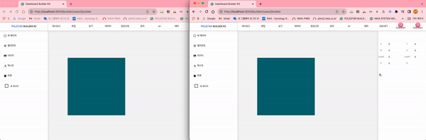<figcaption></figcaption></figure>

> 1. 왼쪽 사용자가 초록색 사각형을 옆으로 2칸 움직임
> 2. 오른쪽 사용자가 초록색 사각형을 아래로 2칸 움직인 후 파란색 사각형을 생성하고 위치를 바꿈
> 3. 왼쪽 사용자가 뒤로가기(undo)를 시행 하였을 때 파란색 사각형은 그대로 있으나, 초록색 사각형은 오른쪽 사용자가 변경한 위치에서 왼쪽 사용자 변화량 만큼 역연산으로 수행됨

```javascript
// src/action/commandPattern.js

export class Command {
  execute() {
    throw new Error("execute method must be overridden");
  }

  undo() {
    throw new Error("undo method must be overridden");
  }

  redo() {
    throw new Error("redo method must be overridden");
  }
}

class CommandInvoker {
  constructor() {
    // undo를 위한 stack
    this.commandsExecuted = [];
    // redo를 위한 stack
    this.commandsUndone = [];
  }

  invoke(command) {
    const result = command.execute();
    this.commandsExecuted.push(command);
    this.commandsUndone = [];
    return result;
  }

  undo() {
    const command = this.commandsExecuted.pop();
    if (command) {
      const result = command.undo();
      this.commandsUndone.push(command);
      return result;
    }
  }

  redo() {
    const command = this.commandsUndone.pop();
    if (command) {
      const result = command.redo();
      this.commandsExecuted.push(command);
      return result;
    }
  }
}

export const commandInvoker = new CommandInvoker();

// src/yorkie/action/handleMove.js

class MoveCommand extends Command {
  constructor(ids, x, y) {
    super();
    this.ids = ids;
    this.x = x;
    this.y = y;
  }

  // history 생성
  execute() {
    doc.update((root) => {
      this.ids.forEach((id) => {
        if (root.nodeTree[id].lock) return;
        root.nodeTree[id].data.attrs.x =
          root.nodeTree[id].data.attrs.x + this.x;
        root.nodeTree[id].data.attrs.y =
          root.nodeTree[id].data.attrs.y + this.y;
      });
    });
  }

  // 역연산 (invert operation)
  // 도형의 움직인 변화량을 역으로 계산하는 함수
  undo() {
    doc.update((root) => {
      this.ids.forEach((id) => {
        if (root.nodeTree[id].lock) return;
        root.nodeTree[id].data.attrs.x =
          root.nodeTree[id].data.attrs.x - this.x;
        root.nodeTree[id].data.attrs.y =
          root.nodeTree[id].data.attrs.y - this.y;
      });
    });
  }

  redo() {
    this.execute();
  }
}

const handleMove = (nodeTree, selectedNodeIds, updateActionFn, args) => {
  commandInvoker.invoke(new MoveCommand(selectedNodeIds, args.x, args.y));
};

export default handleMove;
```

* 클라이언트별 히스토리 기능으로 각 클라이언트가 변경내용만 undo/redo를 수행
* 하지만 단순 순연산에 대한 역연산만 undo에 적용 시 원래 돌아가려는 상태로 가지 못함

#### **3. 커맨드 패턴을 적용 + undo, redo 행위 이전 마지막 원격의 최신 상태를 history를 남김**

**builder**

<figure>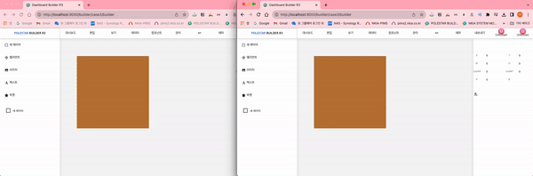<figcaption></figcaption></figure>

**figma**

<figure>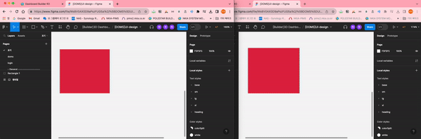<figcaption></figcaption></figure>

> 1. 왼쪽 사용자가 갈색 사각형을 옆으로 3칸 움직임
> 2. 오른쪽 사용자가 갈색 사각형을 아래로 3칸 움직인 후 분홍색 사각형을 생성하고 위치를 바꿈
> 3. 왼쪽 사용자가 뒤로가기(undo)를 시행 하였을 때 분홍색 사각형 그대로 존재, 갈색 사각형도 왼쪽 사용자의 히스토리가 그대로 반영됨
> 4. figma와 동일하게 undo/redo 연산이 적용됨

```javascript
class MoveCommand extends Command {
  constructor(ids, x, y) {
    super();
    this.ids = ids;
    this.x = x;
    this.y = y;
  }

  execute() {
    // 액션을 취하기 전의 타겟 layer의 스냅샷
    this.snapshot = {};
    doc.update((root) => {
      this.ids.forEach((id) => {
        if (root.nodeTree[id].lock) return;
        this.snapshot[id] = {
          x: root.nodeTree[id].data.attrs.x,
          y: root.nodeTree[id].data.attrs.y,
        };
        root.nodeTree[id].data.attrs.x =
          root.nodeTree[id].data.attrs.x + this.x;
        root.nodeTree[id].data.attrs.y =
          root.nodeTree[id].data.attrs.y + this.y;
      });
    });
  }

  undo() {
    // redo stack에 들어가기전 타겟 layer의 스냅샷
    const newSnapshot = {};
    doc.update((root) => {
      this.ids.forEach((id) => {
        if (root.nodeTree[id].lock) return;
        newSnapshot[id] = {
          x: root.nodeTree[id].data.attrs.x,
          y: root.nodeTree[id].data.attrs.y,
        };
        root.nodeTree[id].data.attrs.x = this.snapshot[id].x;
        root.nodeTree[id].data.attrs.y = this.snapshot[id].y;
      });
    });
    this.snapshot = newSnapshot;
  }

  redo() {
    // undo와 동일한 연산, 타겟 layer의 상태만 최신으로 받아옴
    this.undo();
  }
}

const handleMove = (nodeTree, selectedNodeIds, updateActionFn, args) => {
  commandInvoker.invoke(new MoveCommand(selectedNodeIds, args.x, args.y));
};

export default handleMove;
```

* 클라이언트별 히스토리 기능으로 각 클라이언트가 변경내용만 **undo/redo** 를 수행
* 핵심은 undo, redo 수행 전 yorkie (원격 state) 의 스냅샷을 찍는 행위가 서로 다른 클라이언트가 타겟 레이어에 어떤 작업을 한 것을 반영하기 위함
* yorkie doc은 원격에서 모든 클라이언트의 변경 로그를 순차적으로 반영하기 때문에 변경 시점은 최신 상태임'

### undo / redo 를 위한 UI 설계 <a href="#undo-redo-ui" id="undo-redo-ui"></a>

**useUndoRedo.js**

> **undo / redo** 를 단축키와 매핑을 쉽게 만들기 위해 커스텀 훅을 설계하였습니다. undo 와 redo 를 객체 형태로 리턴하고, 해당 핸들러들은, 단축키에 매핑하였습니다.

```javascript
import commandPattern from "./commandPattern";

const useUndoRedo = () => {
  const { executedCommands, undoneCommands } = commandPattern;

  const undo = () => {
    if (executedCommands.length === 0) return;
    const command = executedCommands.pop();
    command.undo();
    commandPattern.undoneCommands.push(command);
  };

  const redo = () => {
    if (undoneCommands.length === 0) return;
    const command = undoneCommands.pop();
    command.redo();
    executedCommands.push(command);
  };

  return { undo, redo };
};

export default useUndoRedo;
```


**단축키에 매핑한 부분**

```javascript
const { undo, redo } = useUndoRedo();
  useShortcuts({
    undo,
    redo,
    // 아래 코드 생략
```

재사용성이 높이기 위해 useUndoRedo 커스텀 훅을 만들었습니다.

**commandPattern.js**

> 커맨드 패턴을 사용해서, 사용자가 어떤 액션을 하였을 때, 커맨드 객체를 생성하고,\
> 해당 커맨드 객체를 executedCommands 스택에 push 하여 undo, redo를 수행할 수 있도록 함 ( 행위를 하였을 때는 현재가 변경되었기 때문에, 미래에 수행할 수 있는 행위는 없어야 함 ) **> undoneCommands 스택을 비워줘야해요! (중요)**

```javascript
const commandPattern = {
  executedCommands: [],
  undoneCommands: [],
};

export default commandPattern;
```

#### handleMove.js <a href="#handlemovejs" id="handlemovejs"></a>

> 액션 핸들러 handleMove.js 에서는, yorkie doc 을 업데이트하고, client 의 project 를 업데이트 합니다. 사용자가 Move 이벤트를 발생시키고, 해당 이벤트가 발생되었을때, MoveCommand 를 생성하고, executedCommands 스택에 push

```javascript
import MoveCommand from "@history/commands/move/MoveCommand";
import commandPattern from "@history/commandPattern";

const handleMove = (nodeTree, selectedNodeIds, setProject, { x, y }) => {
  const { executedCommands, undoneCommands } = commandPattern;

  let snapshot = {};

  // yorkieDoc 업데이트
  selectedNodeIds.forEach((id) => {
    if (nodeTree[id].lock) return;
    // 스냅샷을 저장하는 함수를 나중에 만들자
    snapshot[id] = {
      x: nodeTree[id].data.attrs.x,
      y: nodeTree[id].data.attrs.y,
    };
    nodeTree[id].data.attrs.x += x;
    nodeTree[id].data.attrs.y += y;
  });
  // });

  // client 의 project 업데이트
  setProject((prev) => {
    const newNodeTree = prev.nodeTree.map((node) => {
      if (node.lock) return node;
      if (selectedNodeIds.includes(node.id)) {
        const { x: prevX, y: prevY } = node.data.attrs;
        return {
          ...node,
          data: {
            ...node.data,
            attrs: {
              ...node.data.attrs,
              x: prevX ? prevX + x : x,
              y: prevY ? prevY + y : y,
            },
          },
        };
      }
      return node;
    });

    return {
      ...prev,
      nodeTree: newNodeTree,
    };
  });
  executedCommands.push(MoveCommand(setProject, snapshot));
  undoneCommands.length = 0;
};

export default handleMove;
```

\
**클래스를 상속받아 생성되던 커맨드 객체를 함수로 생성하도록 변경**

> undo / redo 를 하였을때, 최신상태를 반영하기 위해 새로운 snapshot 을 적용

```javascript
import { doc } from "@yorkie/useYorkieClient";

const MoveCommand = (setProject, snapshot) => {
  return {
    undo() {
      const newSnapshot = {};

      // yorkieDoc 뒤로가기
      doc.update((root) => {
        Object.keys(root.nodeTree).forEach((id) => {
          if (root.nodeTree[id].lock) return;
          if (snapshot[id]) {
            newSnapshot[id] = {
              x: root.nodeTree[id].data.attrs.x,
              y: root.nodeTree[id].data.attrs.y,
            };
            root.nodeTree[id].data.attrs.x = snapshot[id].x;
            root.nodeTree[id].data.attrs.y = snapshot[id].y;
          }
        });
      });

      // client 의 project 뒤로가기
      setProject((prev) => {
        const newNodeTree = prev.nodeTree.map((node) => {
          if (node.lock) return node;
          if (snapshot[node.id]) {
            return {
              ...node,
              data: {
                ...node.data,
                attrs: {
                  ...node.data.attrs,
                  x: snapshot[node.id].x,
                  y: snapshot[node.id].y,
                },
              },
            };
          }
          return node;
        });

        return {
          ...prev,
          nodeTree: newNodeTree,
        };
      });

      snapshot = newSnapshot;
    },

    redo() {
      this.undo();
    },
  };
};

export default MoveCommand;
```
